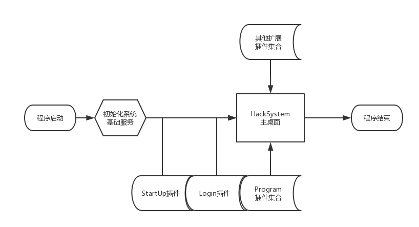
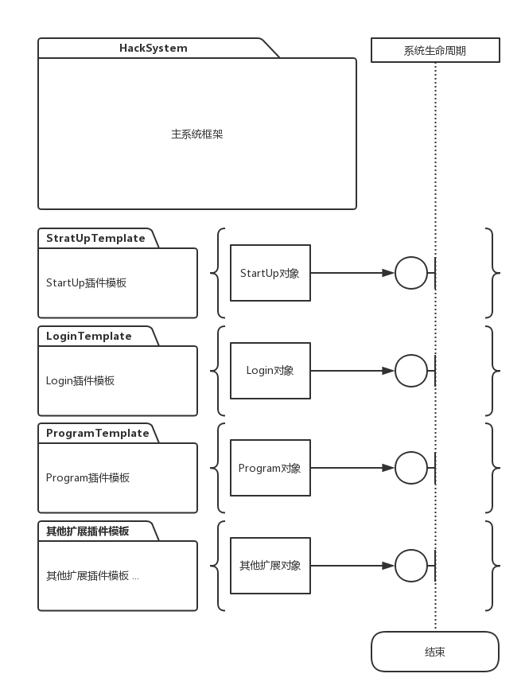
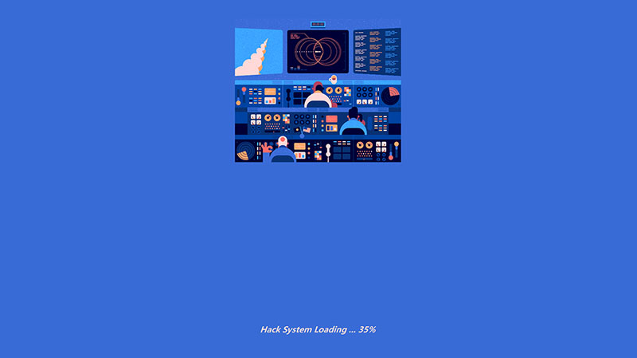
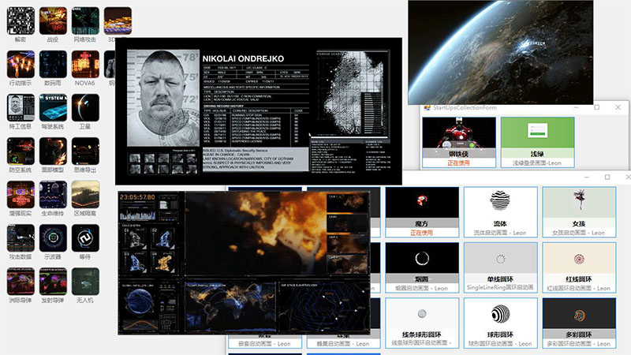

> # ` HackSystem `
> #### 一款允许深度定制的插件式架构模拟操作系统;
> #### via : ` Leon ` [2018 /05 /04]

***
系统采用插件式架构设计，所有允许定制的地方均使用程序集反射技术通过插件的形式实现，拥有极高的自由度和可定制性，使 HackSystem 更开放、更有趣。  
解决方案内含有各种插件开发的“SDK”、开发文档、丰富的插件Demo、项目单元测试 等。
任何拥有 .Net 开发经验的猿媛都可以快速开发出喜欢的自定义插件，只需要把编译得到的插件DLL文件放置在HackSystem框架目录内，通过配置启用该插件即可看到效果。

***
> ### HackSystem-流程图：

***
> ### HackSystem-UML：

***
> ### HackSystem-截图：

* #### 启动

* #### 登录

* #### 桌面

***
联系作者：` Leon.ID@QQ.COM `